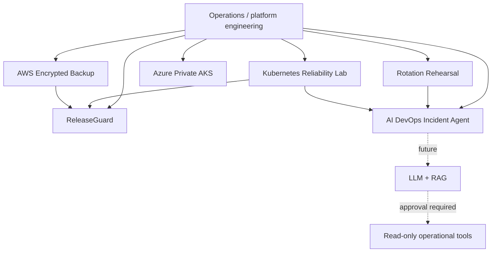

# Portfolio Architecture

This repository is a set of independent engineering labs linked by a common theme: **make operational decisions from explicit evidence, keep trust boundaries visible, and fail safely when evidence is missing or stale.**

## Design principles

### 1. Evidence before automation
ReleaseGuard requires fresh telemetry and restore evidence. Rotation Rehearsal requires plan-bound observations. The Incident Agent starts with deterministic inputs before any model is introduced.

### 2. Human authority stays explicit
No current project automatically performs a destructive cloud, Kubernetes, credential or deployment action. Any future action layer must make approval and auditability first-class concerns.

### 3. Security is part of the design
The labs favor short-lived credentials, least privilege, private control planes, non-root containers, encrypted storage and strict input validation.

### 4. Validation claims are scoped
A passing unit test is not presented as a cloud deployment. Terraform syntax is not presented as production readiness. Each project README states what was actually executed.

## Project relationships

| Project | Inputs | Decision/output | Main trust boundary |
|---|---|---|---|
| AI DevOps Incident Agent | Incident title, symptoms and logs | Signals, runbook guidance, recommended next steps | Recommendations do not execute |
| ReleaseGuard | Service telemetry + restore evidence | Release pass/hold | Evidence authenticity is external |
| Rotation Rehearsal | Consumer/dependency manifest + observations | Migration waves + retirement review | Does not rotate/revoke credentials |
| Kubernetes Reliability Lab | Local service + manifests | Health/metrics/rollout behavior | Demo workload, not production |
| AWS Encrypted Backup | File + S3/KMS configuration | Versioned backup + verified restore | Cloud deployment must be separately authorized |
| Azure AKS Platform | Terraform variables | Private-cluster platform design | Design/validation is distinct from deployment |

## What to review first

For a 10-minute technical review:

1. **ReleaseGuard** — fail-closed operational decision logic.
2. **AI DevOps Incident Agent** — deterministic AI-ready architecture and safety boundary.
3. **Kubernetes Reliability Lab** — workload hardening, probes, disruption policy and runbook.
4. **Rotation Rehearsal** — dependency graph and evidence binding.
