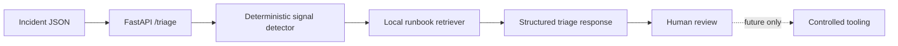

# AI DevOps Incident Agent

A portfolio project that combines DevOps incident reasoning with an AI-ready service architecture.

**Milestone 1 is implemented:** a deterministic FastAPI service accepts an incident, detects operational signals, retrieves matching local runbook guidance and returns structured triage recommendations. It never executes remediation.

## Why start deterministic?

An operations agent should not jump from model output to production changes. This project first separates:

```text
evidence -> detection -> retrieval -> recommendation -> approval -> execution
```

Only the first four stages exist today. `execution_authorized` is always `false`.

## Current architecture



## Run locally

Requires Python 3.12+.

```bash
python -m venv .venv
source .venv/bin/activate
python -m pip install -r requirements-dev.txt
uvicorn app.main:app --reload
```

Open `http://127.0.0.1:8000/docs`.

Example:

```bash
curl -s http://127.0.0.1:8000/triage \
  -H 'content-type: application/json' \
  -d '{
    "service": "checkout",
    "environment": "staging",
    "title": "Checkout latency and database timeouts",
    "symptoms": ["p95 latency increased", "database connection timeout"],
    "logs": ["connection refused while opening database session"]
  }'
```

The response contains detected signals, matching runbook guidance, recommended next actions and:

```json
"execution_authorized": false
```

## Test

```bash
pytest -q
```

The test suite covers health, database-signal detection, resource-pressure detection, unknown incidents and the no-execution boundary.

## Safety boundary

- No shell execution.
- No Kubernetes, cloud or secrets-manager credentials.
- No automatic remediation.
- No network calls from triage logic.
- Runbooks are local, reviewed data.
- Recommendations are advisory.
- Future tools must begin read-only and destructive actions must require explicit human approval and auditability.

## Roadmap

1. **Done:** deterministic triage baseline + tests
2. Strict-schema LLM summarization behind a provider interface
3. Embedding/vector retrieval with an evaluation set
4. Read-only operational tools with human approval gates
5. Kubernetes deployment, CI/CD, tracing, metrics, security and cost controls

The goal is not to hide the deterministic layer with AI; it is to use it as a measurable baseline for later model-assisted behavior.
