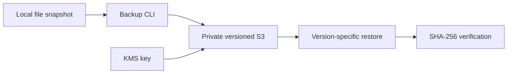

# AWS Encrypted Backup & Restore Lab

**Sai Veerandra Kurakula · Cloud / DevOps portfolio**

Terraform provisions a versioned, private S3 bucket encrypted with a rotating KMS key. Python creates a file snapshot, uploads it beneath a unique key, records its version and SHA-256, and restores that exact version with an integrity check before publishing the restored file.

This is a new independent portfolio lab aligned with AWS, Terraform, Python, IAM and operational reliability skills in my resume. No employer artifacts, past production deployments or measured recovery objectives are claimed.

## Architecture and controls



Public access is blocked, ACLs disabled, HTTP denied, and uploads must explicitly select the configured KMS key. The generated operator policy is limited to `backups/`, has no object deletion permissions, and permits KMS use only through regional S3. The policy is created unattached: an administrator must attach it to a dedicated existing role. No users, access keys or role trust relationships are created.

## Provision in your own sandbox

Prerequisites: Terraform 1.6+, Python 3.12, AWS CLI authenticated with short-lived credentials, permission to create S3/KMS/IAM resources, and an unused bucket name. The default AWS region is Mumbai (`ap-south-1`). KMS, storage and requests cost money.

```bash
aws sts get-caller-identity
terraform init
terraform fmt -check
terraform validate
terraform plan -var='bucket_name=REPLACE-WITH-YOUR-UNIQUE-NAME' -out=lab.tfplan
terraform apply lab.tfplan
python3 -m venv .venv
. .venv/bin/activate
pip install -r requirements.txt
python3 -m unittest -v test_backup.py
```

Review the plan before applying. Keep Terraform state and saved plans private; configure an encrypted remote backend with locking before team use. Commit the generated provider lockfile after reviewing it. Do not commit credentials, state, backup contents or recovery receipts.

## Backup and restore rehearsal

Use a small non-sensitive test file. The snapshot temporarily requires local space equal to the source file.

```bash
printf 'portfolio recovery rehearsal\n' > sample.txt
python backup.py backup sample.txt \
  --bucket "$(terraform output -raw bucket_name)" \
  --kms-key "$(terraform output -raw kms_key_arn)" > receipt.json
```

Save the receipt securely. Supply its exact `bucket`, `key`, `version_id` and `sha256` values:

```bash
python backup.py restore restored.txt --bucket YOUR_BUCKET \
  --key backups/UUID/sample.txt --version EXACT_VERSION --sha256 EXPECTED_SHA256
cmp sample.txt restored.txt
```

Restore requires a new destination in an existing directory on a filesystem supporting hard links. It fails closed on a hash mismatch and refuses to overwrite a file. The original checksum must be retained in a trusted receipt; an attacker who can alter both the backup and receipt defeats this check.

## Runbook and trade-offs

- **AccessDenied:** check caller identity, dedicated role policy, bucket policy, key ARN, region, and KMS permissions. Do not disable encryption or broaden to `s3:*` to fix it.
- **Checksum mismatch:** keep the original file unchanged; validate the receipt and selected version. Investigate before retrying.
- **Recovery measurement:** record upload completion, simulated incident, restore completion and `cmp` result. Calculate your observed recovery time; this project supplies no invented RTO/RPO.
- **Retention:** old versions are retained indefinitely; only incomplete multipart uploads expire after seven days. Monitor storage growth and define a retention policy for real use.
- **Limits:** versioning is not immutable WORM protection. This lab has no Object Lock, cross-region copy, scheduling, CloudTrail data-event trail, alert delivery, malware detection or disaster-proof offline copy. Those are explicit next extensions.
- **Cleanup:** `force_destroy=false` prevents Terraform from silently removing a non-empty bucket. Export needed data, review versions/delete markers, and delete only your disposable test data before `terraform destroy`. KMS deletion is scheduled with a 30-day waiting period; removing the key makes retained encrypted data unusable.

## Validation status

Local unit tests exercise upload/restore behavior with an in-memory S3 double, corruption rejection and overwrite protection. Python compilation and Terraform syntax parsing were checked. Real S3/KMS operations and `terraform validate/plan/apply` have not been run in a cloud account. Run the commands above and keep sanitized evidence before claiming deployment experience from this lab.

## References

- [S3 versioning](https://docs.aws.amazon.com/AmazonS3/latest/userguide/Versioning.html)
- [S3 KMS encryption](https://docs.aws.amazon.com/AmazonS3/latest/userguide/UsingKMSEncryption.html)
- [AWS Terraform provider](https://registry.terraform.io/providers/hashicorp/aws/latest/docs)
- [Kubernetes reliability companion](../kubernetes-sre-lab)
