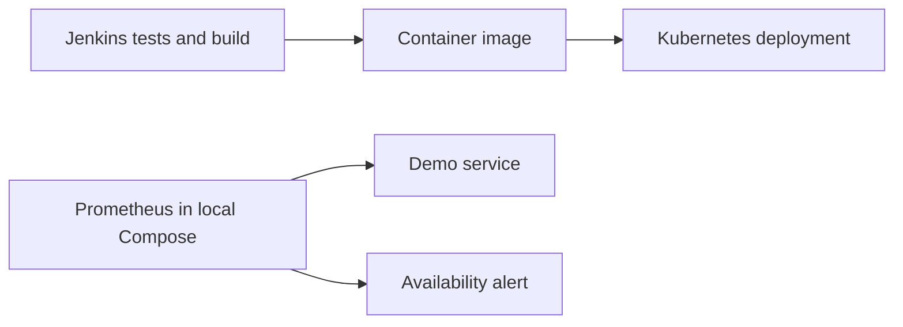

# Kubernetes Reliability & Observability Lab

An executable DevOps portfolio lab by **Sai Veerandra Kurakula**: a small Python service, hardened container, Kubernetes deployment, Jenkins build pipeline, and Prometheus health alert. The original `index.html` is preserved.

This is a newly created portfolio demonstration aligned with my resume's Kubernetes, Docker, Jenkins, Python, Linux, and monitoring skills. It is not employer source code or a claim of historical production results.

## Architecture



Compose and Kubernetes are separate deployment modes. Prometheus is wired to the **Compose** service; this repository does not automatically install a Kubernetes monitoring stack.

## Run locally

Requires Python 3.12, Docker and Docker Compose v2.

```bash
python3 -m unittest -v test_app.py
docker compose up --build -d
curl -fsS http://localhost:8080/readyz
curl -fsS http://localhost:8080/metrics
```

Open `http://localhost:9090`, query `up{job="platform-demo"}` and `rate(demo_http_requests_total[5m])`. The request counter includes health probes and metric scrapes; it is not a customer-traffic or error-rate SLI. No external packages are needed for the service.

## Run on local Kubernetes

Requires a local kind cluster, Docker and kubectl. Use a disposable cluster. NetworkPolicy enforcement depends on the cluster CNI; default kind networking does not enforce this policy.

```bash
kind create cluster --name portfolio
docker build -t platform-demo:local .
kind load docker-image platform-demo:local --name portfolio
kubectl apply -f kubernetes.yaml
kubectl -n platform-demo rollout status deployment/platform-demo --timeout=120s
kubectl -n platform-demo port-forward service/platform-demo 8080:8080
# In another terminal:
curl -fsS http://localhost:8080/healthz
```

For EKS/AKS, push the image to your private registry and replace `platform-demo:local` with its immutable digest before applying. Keep the service internal. Add a policy rule for an explicitly selected monitoring namespace if deploying Prometheus separately.

## Design decisions

- Two replicas and a disruption budget demonstrate rolling updates and voluntary-disruption protection. They do not guarantee zone resilience without placement constraints and multiple nodes.
- Non-root UID, read-only filesystem, dropped capabilities, no mounted API token, restricted pod admission, and bounded CPU/memory reduce exposure.
- Readiness and liveness are deliberately simple because the demo has no database dependency. A real service should separate dependency readiness from process liveness.
- The Jenkins pipeline tests, builds, and smoke-tests; it does not deploy or access cloud credentials. Configure a trusted agent with Python and Docker and a Pipeline from SCM using this `Jenkinsfile`.
- The standard-library HTTP server is for demonstration, not an internet-facing production server.

## Operations and evidence

See [RUNBOOK.md](RUNBOOK.md) for failure drills, recovery, and cleanup. Capture your own rollout, alert-firing, and recovery evidence after running the lab. No cloud deployment or production benchmark is claimed.

Validation performed during authoring: Python integration tests and YAML syntax parsing. Docker, Kubernetes, and Jenkins execution require the tools/environment described above and have not been executed here. Container tags are readable lab defaults; scan and pin approved digests before production use.

## More portfolio projects

- [AWS encrypted backup and restore](../aws-encrypted-backup-lab)

## References

- [Kubernetes security context](https://kubernetes.io/docs/tasks/configure-pod-container/security-context/)
- [Kubernetes probes](https://kubernetes.io/docs/tasks/configure-pod-container/configure-liveness-readiness-startup-probes/)
- [Prometheus alerting rules](https://prometheus.io/docs/prometheus/latest/configuration/alerting_rules/)
