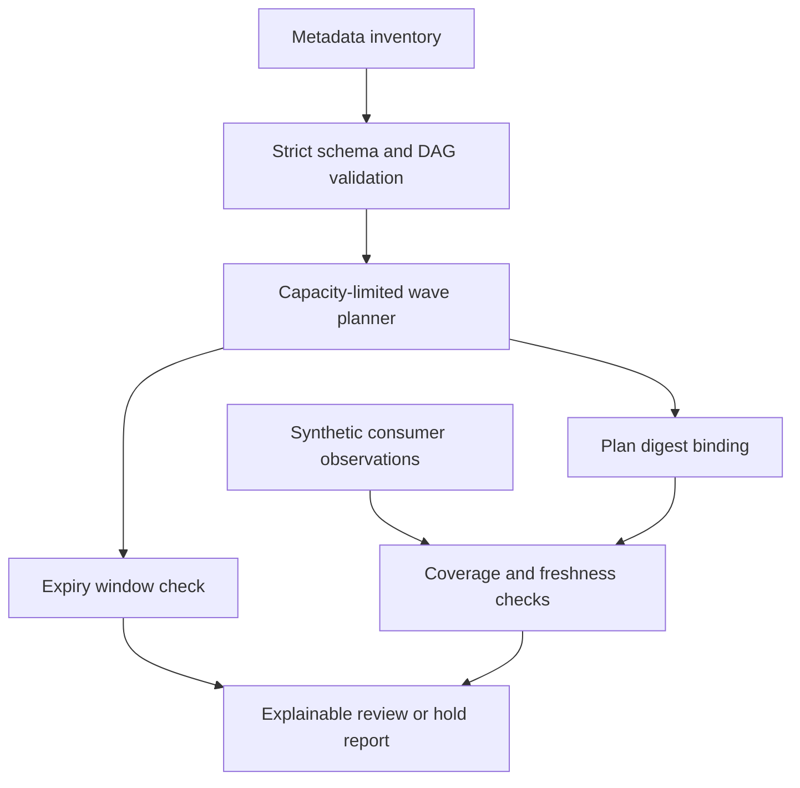

# Rotation Rehearsal — dependency-aware secrets migration

An original, offline Python portfolio demonstration by Sai Veerandra Kurakula. It answers an operational question: **can every known consumer move to a new credential version before the old one expires, with the people available to supervise it?** It then checks whether supplied observations support a human retirement review.

This is newly authored demonstration code, not employer work, a deployed secrets platform, an audit control certification or a claim of global novelty. It complements [ReleaseGuard](../releaseguard), which checks release health and backup evidence; this project focuses on migration ordering, shared operator capacity and credential retirement.

## Quick start

Python 3.11+; standard library only. No packages, accounts, network access or credentials required. From this directory:

```sh
python -m unittest -v
python rotation.py samples/inventory.json --start-at 2026-10-05T10:00:00Z
python rotation.py samples/inventory.json --start-at 2026-10-05T10:00:00Z \
  --evidence samples/healthy.json --check-at 2026-10-05T10:12:30Z
python rotation.py samples/inventory.json --start-at 2026-10-05T10:00:00Z \
  --evidence samples/old-version.json --check-at 2026-10-05T10:12:30Z
```

All sample data is synthetic. The first two commands return 0 (`ready_for_review`); the old-version scenario returns 1 (`hold`). Invalid inputs return 2. **Exit 0 is successful rehearsal analysis, never permission to deploy, rotate or revoke.** Every result contains `execution_authorized: false`. Explicit times make replay deterministic; the tool is not a live production gate.

The sample represents a database-login migration: connection proxy first, checkout API and refund worker next, reconciliation last. One payments operator forces the API and worker into separate waves. The resulting estimate is 720 seconds across four waves. Increasing payments capacity to two produces three waves and 540 seconds; this is a synthetic scheduling result, not a production performance claim. Changing the manifest invalidates existing evidence bindings.

## Architecture and decisions



- One credential/version migration per manifest. Multiple credentials require separate reviewed plans; this tool does not coordinate shared capacity across simultaneous plans.
- `depends_on` means a consumer's rollout **and verification** must finish before another starts. It is a migration dependency, not automatic discovery of network or application dependencies.
- Each consumer occupies one slot in its owning team for its rollout plus verification duration. A wave ends at its slowest consumer. Lexical selection and barrier waves give deterministic, conservative schedules; this is a feasible greedy plan, not an optimal scheduler. Delays require a revised plan.
- All dependencies must exist, be unique and form a DAG. Duplicate consumers, unknown teams, booleans passed as numbers, empty inventories and invalid durations are rejected. Limits: 100 consumers, 100 teams, 1 MB input, individual durations 1–86,400 seconds.
- Old-version expiry must leave at least 600 seconds after estimated completion. Retirement review also checks the margin remaining at evaluation time. This buffer is a fixed lab policy, not a guaranteed rollback window.
- Evidence must cover exactly the inventory, match the SHA-256 plan digest, report every consumer healthy on the new version, and be no older than 300 seconds. All observations must be at or after the planned finish and at or before evaluation time. This conservative final recheck avoids relying on observations from earlier waves.
- The plan digest binds the entire metadata manifest and normalized start timestamp. It detects accidental mismatches; **it is not a signature or proof of authenticity**. Reordering arrays changes the digest. Neither it nor a healthy flag proves the actual credential has been exercised.

## Metadata contract and security boundary

The exact manifest schema is illustrated in `samples/inventory.json`. `teams` maps team identifiers to concurrent supervision capacity. Each consumer has exactly `id`, `team`, `depends_on`, `rollout_seconds`, `verify_seconds`. Credential and version fields are **opaque non-secret aliases**, never values, paths containing sensitive names, access tokens or passwords. Timestamps must have an explicit timezone. Unknown fields, duplicate JSON keys and nonfinite numbers are rejected.

Evidence contains exactly `plan_id` and `observations`; each observation contains `consumer`, `version`, boolean `healthy`, and timezone-aware `observed_at`. See the two evidence samples. Missing or extra consumer coverage holds; malformed schemas fail with exit 2. Output includes aliases, plan timing and checks, so treat reports as potentially sensitive operational metadata. Invalid-input output deliberately omits raw values and exception details. An accidentally supplied secret in an otherwise valid alias field cannot be recognized reliably: sanitize inputs before running.

There are no Vault, CyberArk, AWS or Azure adapters, API clients, shell execution, credential reads, rotations or revocations. A future separately reviewed collector could produce sanitized version/health metadata from a secrets platform and application probes. It would need authenticated provenance, complete consumer discovery, clock synchronization, version-specific probe semantics and restricted artifact access. Do not connect exit 0 directly to a revocation pipeline.

## Operations, cleanup and validation

See [RUNBOOK.md](RUNBOOK.md) for migration preparation, hold handling, rollback considerations and cleanup. Local verification: 15 automated tests passed, including CLI subprocess checks, scheduling, expiry/freshness boundaries, digest binding and invalid-input handling. Both evidence scenarios were exercised locally. No secrets provider, Kubernetes cluster, cloud environment or live rotation has been tested. Duration estimates and consumer completeness are assumed inputs; real systems can drift after an observation.

Future extensions: signed collector evidence, explicit dual-version capability checks, actual per-wave completion receipts and coordination across concurrent rotations. The current project deliberately makes no production authorization claim.
